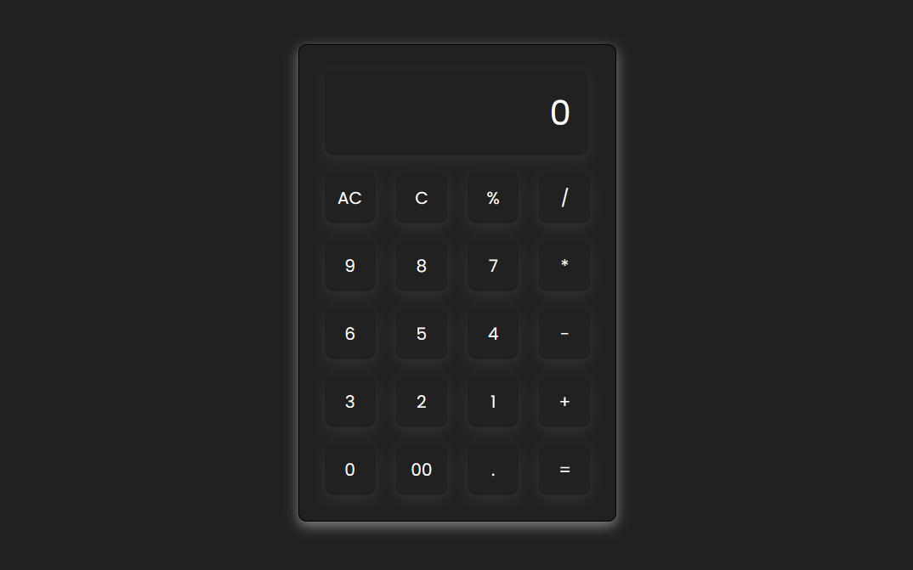

# Basic Web Calculator

A simple and responsive **Web Calculator** built using **HTML, CSS, and JavaScript**.  
This project performs basic arithmetic operations through an easy-to-use calculator interface.

## 📸 Project Preview



## 🚀 Features

- Perform basic arithmetic calculations.
- Addition, subtraction, multiplication, and division.
- **AC** button to clear the complete input.
- **C** button to remove the last entered character.
- **=** button to calculate the result.
- Interactive buttons using JavaScript.
- Simple and user-friendly interface.
- Responsive design.

## 🛠️ Technologies Used

- HTML5
- CSS3
- JavaScript

## 🧠 How It Works

The calculator uses JavaScript to handle button clicks and perform calculations.

- `querySelectorAll()` is used to select all calculator buttons.
- `addEventListener()` handles button click events.
- A string stores the current calculator input.
- `substring()` removes the last character when the **C** button is pressed.
- `eval()` evaluates the mathematical expression when **=** is pressed.
- `input.value` displays the entered expression and result.

## 📂 Project Structure

```text
Basic-Calculator/
│
├── index.html
├── style.css
├── script.js
├── project-preview.png
└── README.md
```

## ▶️ How to Run

1. Clone or download this repository.
2. Open the project folder.
3. Open `index.html` in your browser.
4. Use the calculator to perform basic calculations.

## 📚 What I Learned

While building this project, I learned:

- DOM manipulation in JavaScript.
- Selecting multiple HTML elements.
- Handling button click events.
- Working with strings in JavaScript.
- Using `Array.from()`.
- Updating input values dynamically.
- Implementing calculator logic.

## ⚠️ Note

This project uses JavaScript's `eval()` function to evaluate mathematical expressions. It was used here for learning and simplicity.

## 👨‍💻 Author

**Suresh Suthar**

A beginner-friendly project created to practice **JavaScript DOM manipulation and event handling**.